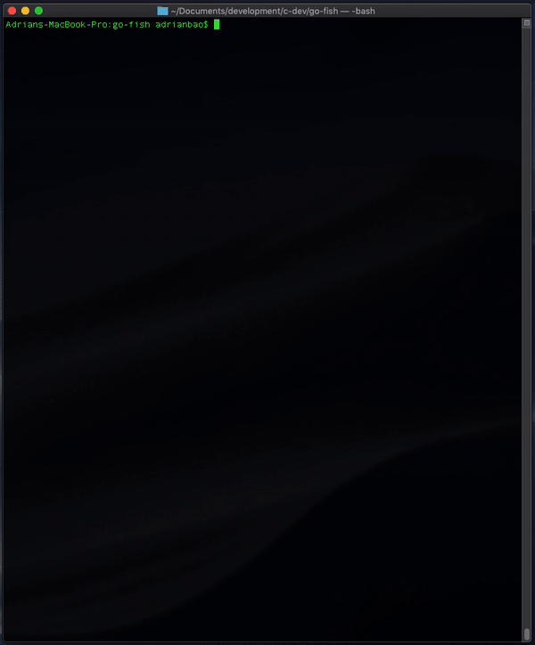
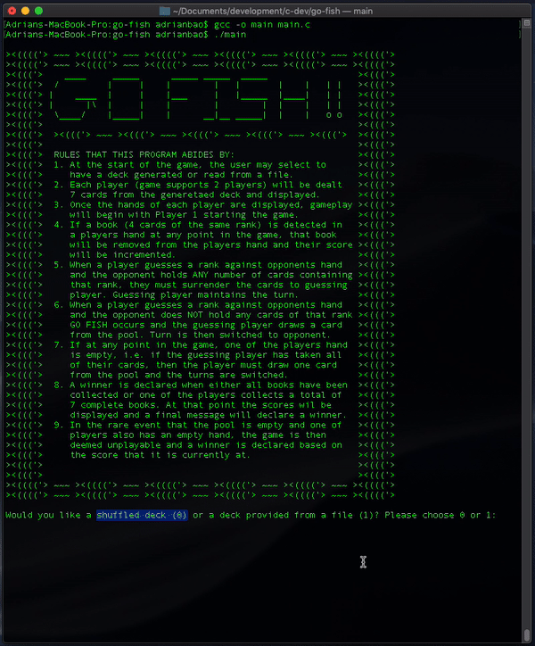

# Go Fish
- [Getting Started](#getting-started)
- [Playing the Game](#playing-the-game)

# Getting Started
1. Clone this repo and ensure you have `gcc` installed on your machine
2. `cd` into `go-fish` and run the following to build the executable
    ```
    $ gcc -o main main.c
    ```
3. Run the program using
    ```
    $ ./main
    ```

    


# Playing the Game
When initially starting up the game, it will request for a method of generating a deck to start with. You may select either of the following:

1. Select `0` for an internally randomly generated deck
   - Use this method for the quick and easy initialization for the game. 
2. Select `1` and provide the filename/path of an input file in the required format to input a preconfigured deck.
   - You are provided two sample input files preformatted with an ordered/unordered organization of the deck. These can be found in `./test-input-files/*`

   