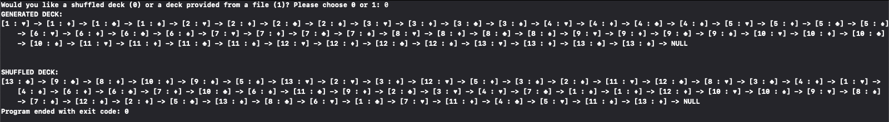
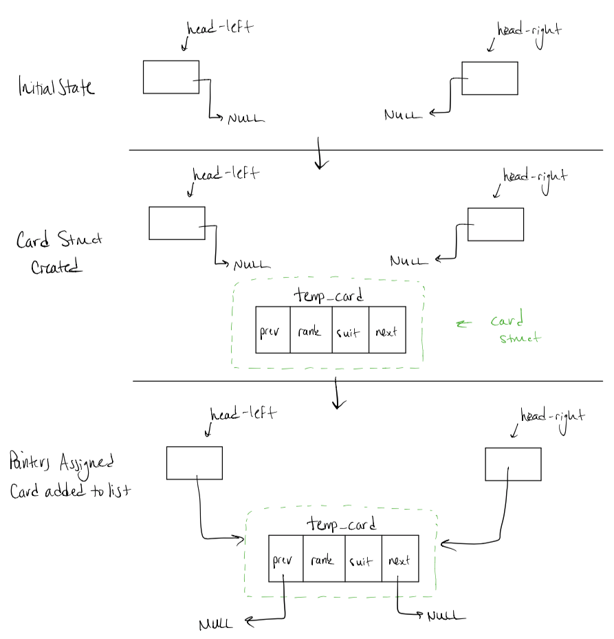
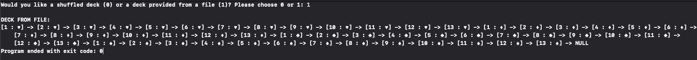
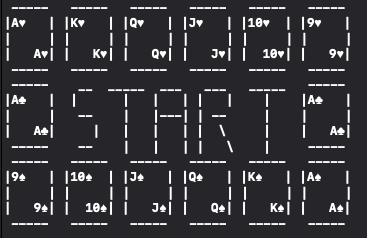

# GoFish
Final Project for ECE175

<h1> Directory </h1>

<ul>
  <li> <strong>Project Images</strong> </li>
  - This folder includes various output images taken of the program behavior as documentation used below.
  <li> <strong>Reference Programs</strong> </li>
  - Folder that includes simplified implementations of doubly-linked lists and shuffling mechanics.
  <li> <strong>Test Files</strong> </li>
  - Folder that includes the various .txt files that are used to test the option where the user can provide a file to be read and generate a 52-card deck from the contents of the file.
  <li> <strong>Visual Design</strong> </li>
  - Folder that includes the general structure design of various aspects of the program, such as the visual design of the deck and player-hands as well as the visual design of a possible title. 
</ul> 

<br>

<h1> Latest Adjustments </h1>

<ul>
  <li> 11/21/2018 - Implement structure to read in a file of pre-formatted input used to initialize the standard 52-deck and populate Linked List with values read from the file </li>
  
  <li> 11/24/2018 - Create Reference Programs folder to include various different programs to reference certain methods and function used to implement the final project structure.
  
- First program uploaded includes doubly-linked list creation by using double pointers.
- Second program uploaded includes how to swap values from two nodes with given indices. We can use this method to shuffle the deck of cards
</li>

<li> 11/24/2018 - Implement structure of Double-Linked List. Uses double pointers to populate the LinkedList by parsing a given file and adding each Card structure to the LinkedList. </li>
<li> 11/24/2018 - Implement shuffling structure of the main deck of cards upon initial start of the game. Currently set to 100 swaps to shuffle the deck. Will swap the value and suit of the card to avoid restructuring the entire linked list.

- Output also formatted to display the unicode character instead of the word. Will be replaced in the future with actual card designs.</li>
<li> 11/24/2018 - Finalize deck construction (Doubly-Linked List) and Shuffling method. Current implementation supports both requests from specs which allows the user to do either of the following:
  
  - (0) Program generates a shuffled deck for the user and displays onto the console.
  - (1) User provides a pre-formatted file that will be read and parsed to generate a deck from the contents of the file.
</li>
<li> 11/25/2018 - Shuffling method implemented to shuffle the generated deck created when the user selects option 0 (generating a shuffled deck as opposed to reading deck from a file). </li>
<li> 11/27/2018 - Created title to enhance the UI Element of the project. </li>
<li> 11/27/2018 - Added and detailed the strucutred 'skeleton' of the future features to be added into the program. Documeneted all function prototypes and parameters expected as input and output of the functions. </li>
</ul>

<h1> Construction Documentation </h1>

<h2> 1. Doubly-Linked List Implementation </h2>

<p> This program implements the use of Doubly-Linked List for the ease of traversal and pointer adjustments when adding and removing cards to and from user decks and pool of cards. The following Struct declaration was used to hold specified attributes needed for the Card information and Doubly-Linked List capabilites: 

```C
typedef struct card_s {
    char suit[SUIT_LENGTH];
    int value;
    struct card_s *prev;
    struct card_s *next;
} card;
```
</p>

<br>

<p> The first portion of this program requires the user to choose if they want to a shuffled deck or load a predefined set of cards from a file. The current implementation of the program currently sets the selection based off a binary choice. If the user selects 0, a shuffled deck is generated and displayed. If the user selects 1, a file is read and parsed into a deck and displayed. </p>

<h3> First Option: Shuffled Deck Selection (0) </h3>

<p> This option, if selected, will generate a deck of 52 cards using for loops and runs the deck through the shuffler that performs 200 swaps and displays the pre- and post-shuffled decks to the user. The generation is done using two nested for loops, the outer loop controlling the rank (1-13) and the inner loop controlling the suit (hearts, diamonds, clubs, spades). The following snippet shows how the deck is generated. (NOTE: description of the <strong>add_to_head( ... )</strong> function is further below).
  
  ```C
  1   char suits[4] = {'h', 'd', 'c', 's'}; // Used to iterate through each suit of the deck
  2   if (deck_init == 0) {
  3        // Construct a standard sequential deck then shuffle it 200 times
  4        for (int i = 1; i <= 13; i++) {
  5            for (int j = 0; j < 4; j++) {
  6                card *temp_card = (card*)malloc(sizeof(card));
  7                temp_card->value = i;
  8                if (suits[j] == 'h') {
  9                    strcpy(temp_card->suit, "hearts");
  10               } else if (suits[j] == 'd') {
  11                   strcpy(temp_card->suit, "diamonds");
  12               } else if (suits[j] == 'c') {
  13                   strcpy(temp_card->suit, "clubs");
  14               } else if (suits[j] == 's') {
  15                   strcpy(temp_card->suit, "spades");
  16               }
  17               add_to_end(hr, &hl, &hr, temp_card); // Adds temp_card to the list
  18           }
  19       }
  20      
  21       ... // Code for shuffling explained below...
  ```
  Note the dynamic allocation of memory for each Card Struct within the for loop. This satisfies the requirement of the dynamically generating a deck of cards, ensuring proper usage of memory. Line 6 of the snippet above dynamically allocates memory to the pointer, the size of which is the size of a Card Struct. This newly allocated memory is then populated with the data pulled from the loops and added to the Linked List with the function call of <strong>add_to_head( ... )</strong> at line 17.
  
  
  Once the deck is generated, it is then shuffled by swapping two randomly selected cards within the deck. This operation is performed 200 times to ensure a unique shuffled deck. When calling the shuffle function, <strong>hl (head-left)</strong> is passed to the function to allow the method to have access to the entire Linked List. Inside the shuffle function, two random indices are generated using RNG and used to traverse the Linked List and perform the swap on the two cards. 
  
  ```C
    // Find number of cards present in the pool
    int num_cards = find_length(hl);
    
    int num_swaps = 200;
    int idx_1, idx_2;
    for (int i = 0; i < num_swaps; i++) {
        idx_1 = rand_gen(num_cards);
        idx_2 = rand_gen(num_cards);
        
        // Need to ensure that we don't swap a card with itself
        while (idx_2 == idx_1) {
            // Grab another random index
            idx_2 = rand_gen(num_cards);
        }
        swap(hl, idx_1, idx_2);
    }
  ```
  
  Once the deck is shuffled, the output is then printed as follows: </p>



<p> Here, the generated deck is the one created with the for loops. The shuffled deck is the deck after being passed through the shuffling portion of the program. </p>


<br>

<h3> Second Option: Read from file Selection (1) </h3>

<p> When the user selects this option, the program will read input from a specified file in the following format: 
  
  ```
  Rank Suit
  Rank Suit
  ...
  A hearts
  8 diamonds
  9 spades
  ```
  
  Suits are formatted as all lowercase and placed a single space after the given Rank. Rank will be provided in the following range: A, 2-10, J, Q, K. The program will read the Rank in as a character and typecast it to an <strong>int</strong> with the following guidelines:
  
  ```
  A -> 1
  J -> 11
  Q -> 12
  K -> 13
  ```
  
  This allows for ease of processing later in the program when the users are playing the game of GoFish and requesting for a specific suit. Rather than having to search for a specific character, they are order sequentially by values starting from 1 to 13.
  
  As each line is processed using a while loop, the temp_card that has been created with the current line read from the file is passed along with references to the <strong>head-left</strong> and <strong>head-right</strong> of the Doubly-Linked List. The function call will look like so:
  
  ```C
  add_to_end(hr, &hl, &hr, temp_card);
  ```
  
  Here, hr is the current Card Object that the pointer, hr (head-right), is pointing to. <strong>&hr and &hl</strong> are the address of the head pointers themselves so that the add_to_end function can make the necessary adjustments after the Card Object has been added to the LinkedList. The receiving parameters of the function look like the following:
  
  ```C
  void add_to_end(card *p, card **hl, card **hr, card *temp_card) { ... }
  ```

The return type is void since all changes made to head-left and head-right occur within the function, reassigning pointers when necessary. As stated before, hl and hr and references to the pointers in main so that we can make adjustments within this function without having to return them both...

Two cases are handled within this function. The first is when the list is currently empty, that means that <strong>head-left</strong> does not point to anything, thus is equal to NULL. If check is made for this condition and the result is TRUE, then we must first set the two head pointers (head-left and head-right) to point to the new Card introduced to the LinkedList. The final step once the pointers are set is to set the internal attributes of the Card. Since it was the first Card added to the LinkedList, we need to set the <strong>next</strong> and <strong>prev</strong> attributes to NULL since they will not point to anything yet.

```C  
if (*hl == NULL) {
     // List is empty
     *hl = temp_card;
     hr = temp_card;
     temp_card->next = NULL;
     temp_card->prev = NULL;
} else { ... }
```

The process of executing the above mentioned code is as follows:

</p>
<br>
<p> The second case that is handled when adding to the list is when there is already Card Objects in the list, i.e. <strong>head-left is NOT NULL</strong>. When head-left is checked and found that it is pointing to a Card, then we must adjust the necessary pointers as before only this time, we need to ensure the <strong>prev</strong> attribute is adjusted. Note that <strong>p</strong> here is the Card that <strong>hr</strong> (head-right) is pointing to as stated in the function call. When <strong>p->next</strong> is NULL, that means it is the last element in the list and that is where the current Card should be inserted.
  
  ```C
  if (*hl == NULL) {
      // Broken down above
  } else if (p->next == NULL) {
      p->next = temp_card;
      temp_card->prev = p;
      temp_card->next = NULL;
      *hr = temp_card;
  }
  ```

The process of executing the above mentioned code is as follows:

<br>

Once the file is completely processed and all data has been parsed into Card Structs, then the Doubly-Linked List is fully constructed with a total of 52 Cards. When the program is run using <strong>ordered_deck.txt</strong>, which is a file that sequentially goes through each suit and rank, the output of that program will look like the following. (NOTE: Current output is only formatted with unicode symbols, actual card representations will follow in future updates).



</p>


<h3> Initial Title </h3>

<p> The current title implemented into the program is used to enhance the UI Element of the program. It may be changed a future update. </p>


